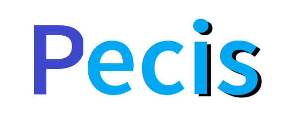

<p align="center">

</p>

---

<p align="center">
  <a href="https://github.com/TechPot-Studio/Pecis/commits/master" title="Commit Activity"></a>
  <a href="https://www.codacy.com/gh/TechPot-Studio/Pecis/dashboard?utm_source=github.com&amp;utm_medium=referral&amp;utm_content=TechPot-Studio/Pecis&amp;utm_campaign=Badge_Grade" title="Codacy"></a>
  <a href="//github.com/TechPot-Studio/Pecis/stargazers" title="Stars"></a>
  <a href="//github.com/TechPot-Studio/Pecis/issues" title="Issues"></a>
  <a href="//github.com/TechPot-Studio/Pecis/pulls" title="Pull Requests"></a>
  <a href="//github.com/TechPot-Studio/Pecis/network/members" title="Forks"></a>
  <a href="https://www.npmjs.com/package/pecis" title="NPM Version"></a>
  <a href="https://www.npmjs.com/package/pecis" title="NPM Downloads"></a>
  <a title="jsdelivr hits"></a>
  <a href="./LICENSE" title="License"></a>
  <a href="https://discord.gg/EvsaWcB" title="Chat"></a>
  <a href="" title="Contributors"></a>
  <a href="//github.com/TechPot-Studio/Pecis/releases" title="Lastest Release"></a>
  <a href="//github.com/TechPot-Studio/Pecis/releases" title="Lastest Pre-Release"></a>
  <a href="//github.com/TechPot-Studio/Pecis/releases" title="Commits Since Latest Release"></a>
  <a href="src/Pecis" title="Size"></a>
  <a href="./dist/pecis.min.js" title="Minified Size"></a>
  <a title="Node.js Version"></a>
  <a title="ECMAScript Version"></a>
</p>

寻找其它语言版本的README?<br />
简体中文 | [English](README.md)
## 关于
让JS Web开发更简便的 ECMAScript 6 轻量级API。让代码更快、更高效、更易读，并且与其它一部分API兼容。由TechPot Studio创作，一些方法借鉴了jQuery，并且基本符合大众的书写习惯。
  
微软对Internet Explorer的支持已经结束，从`v3.0.0`版起，我们也将停止兼容旧版浏览器的支持

### 命名
Web的法语是le lacis，而我们的原名为Peb，并且Pecis与Pieces谐音。

## 下载
### 使用 **NPM**

[](https://www.npmjs.com/package/pecis)

```shell
$ npm install pecis
```
```javascript
/* ES6 */
import pecis from 'pecis'
/* CommonJS */
```
**\*** 如果您使用Node.js，请使用14.0.0以上版本。旧版本可能可以运行，但可能出现严重错误
### 或者，从其它第三方API抓取
#### jsdelivr
```html
<script src="//cdn.jsdelivr.net/npm/pecis" type="module"></script>
```
#### unpkg
```html
<script src="//unpkg.com/pecis" type="module"></script>
```
`type="module"`只在`v3.1.0`后适用

当然，下载源码也是允许的
## 浏览器支持
以下浏览器最低支持此包的版本
| 浏览器 |  |  |  |  |  |
|------: | :------: | :------: | :------: | :------: | :------: |
| **完全**支持 | 54 | 63 | 10.1 | 79 | 41 |

进入文档可查看具体函数支持版本  
**数据来源：[*developer.mozilla.org*](//developer.mozilla.org)**

## 负责人
[@TechPot-Studio/pecis](https://github.com/orgs/TechPot-Studio/teams/pecis) 

## 脚注
- ZH 版本可能会更新较慢，可能出现一个版本中两个README不同的情况
